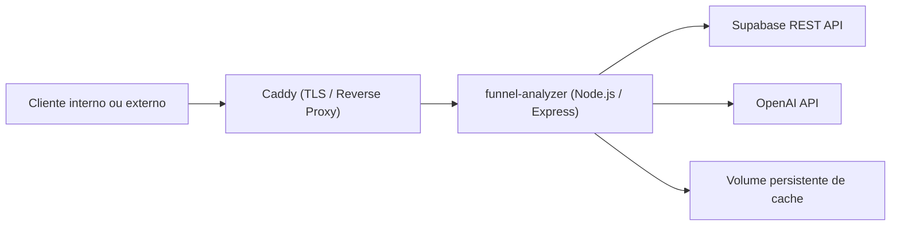

# Deploy Seguro em VPS Ubuntu - Documento de Handoff

**Projeto:** `funnel-analyzer`  
**Data:** 2026-04-17  
**Objetivo:** consolidar o contexto técnico, as decisões já tomadas e os requisitos de infraestrutura e aplicação para permitir que a equipe de desenvolvimento implemente o deploy seguro da API em uma VPS Ubuntu, preparada tanto para uso interno quanto para exposição futura na internet.

---

## 1. Resumo Executivo

O `funnel-analyzer` é uma API Node.js/Express que:

- lê conversas do Supabase
- detecta etapas de funil localmente por regex
- usa OpenAI para:
  - extrair `stageConfig` a partir de prompts
  - gerar relatório analítico em Markdown
- persiste resultados e configurações de funil no Supabase
- usa cache local em disco para evitar reprocessamento desnecessário do prompt

A decisão já tomada para produção é:

- **VPS alvo:** Ubuntu
- **Modelo operacional:** Docker Compose
- **Proxy reverso:** Caddy
- **Exposição final:** domínio com HTTPS
- **Porta pública:** apenas `80` e `443`
- **Porta interna da aplicação:** `3000`, nunca exposta diretamente
- **Fonte de dados e persistência:** Supabase
- **Uso inicial:** interno/privado
- **Preparação estrutural:** pronta para exposição pública futura
- **Condição para abertura pública:** autenticação por token, hardening básico da API e documentação revisada

Este documento não é um plano de implementação passo a passo. Ele é um **handoff técnico detalhado** para a equipe que vai construir e operar essa entrega.

---

## 2. Estado Atual do Projeto

### 2.1 Stack e bibliotecas

Dependências atualmente identificadas no repositório:

- `express`
- `dotenv`
- `openai`
- `jest`
- `supertest`

### 2.2 Entry point e execução atual

- Entry point atual: `src/server.js`
- Script de produção: `npm start`
- Script de desenvolvimento: `npm run dev`
- Script de testes: `npm test`

Observação importante:

- o código usa `fetch` global, então o runtime precisa ser **Node 18+**

### 2.3 Módulos principais

- `src/server.js`: expõe as rotas HTTP e valida entradas
- `src/supabase.js`: consulta `wa_chats` e `wa_messages` na REST API do Supabase
- `src/repository.js`: persiste `funnel_configs`, `analysis_runs`, `analysis_conversations` e `analysis_events`
- `src/prompt-parser.js`: usa OpenAI para extrair `stageConfig`
- `src/report-writer.js`: usa OpenAI para gerar relatório
- `src/filter.js`: separa conversas profissionais e pessoais
- `src/stage-detector.js`: detecta etapas do funil
- `src/metrics.js`: gera métricas agregadas
- `src/cache.js`: armazena cache local em arquivos JSON

### 2.4 Endpoints atuais

- `GET /health`
- `GET /cache`
- `DELETE /cache/:hash`
- `POST /funnel/build`
- `POST /analyze`
- `GET /configs/:account_id`
- `PUT /configs/:account_id`
- `GET /runs/:account_id`
- `GET /runs/:account_id/:run_id`

### 2.5 Dependências externas de runtime

A aplicação depende obrigatoriamente de:

- `SUPABASE_URL`
- `SUPABASE_KEY`
- `OPENAI_API_KEY`

Variáveis atuais opcionais:

- `PORT`
- `CACHE_DIR`

### 2.6 Testes atuais

O repositório está com testes automatizados existentes para:

- rotas HTTP
- repository
- integração de request com Supabase
- cache
- filtro
- stage detector
- métricas

Estado verificado no ambiente local desta análise:

- `104` testes passando

---

## 3. Problema que o Deploy Precisa Resolver

O projeto hoje roda como API Node local e ainda não está preparado para um deploy seguro em VPS pública.

Os principais gaps são:

- não existe containerização
- não existe proxy reverso
- não existe TLS
- não existe autenticação da API
- não existe separação entre liveness e readiness
- endpoints utilitários de cache estão livres
- a `SUPABASE_KEY` usada pela API possui alto privilégio
- o relatório ainda está parcialmente especializado em clínica estética
- a API atual de `/analyze` ainda depende do envio de `stageConfig` completo no body

O objetivo da entrega da equipe de dev é remover esses gaps sem mudar o propósito central do produto.

---

## 4. Decisões Já Fechadas

Estas decisões já foram tomadas e não devem ser reabertas sem nova validação:

### 4.1 Infraestrutura

- usar **Ubuntu** como host
- usar **Docker Compose**
- usar **Caddy** como proxy reverso
- usar **domínio com HTTPS**
- expor apenas `80/443`
- não expor `3000` para fora do host
- manter `.env` fora da imagem Docker
- persistir o cache local em volume dedicado

### 4.2 Estratégia de publicação

- a infraestrutura deve nascer pronta para uso interno e para futura exposição pública
- a abertura pública não deve acontecer antes da camada de autenticação e do endurecimento mínimo da API
- a versão futura da API pode subir já com o **contrato novo**, sem compatibilidade com o payload antigo, porque ainda não existe produção ativa

### 4.3 Escolhas de interface já consolidadas

Para resolver inconsistências entre conversas anteriores e o spec já existente no repositório, adotar como padrão:

- autenticação via `Authorization: Bearer <token>`
- variável de ambiente `API_TOKEN`
- novos campos do `/analyze`: `start_date` e `end_date`
- remoção de `stageConfig` do body do `/analyze`
- resolução de configuração por `config_id` ou `account_id`

Essas escolhas alinham este handoff ao documento já existente:

- [2026-04-17-api-restructuring-design.md](/C:/Users/user/Documents/GitHub/funnel-analyzer/docs/superpowers/specs/2026-04-17-api-restructuring-design.md)

---

## 5. Arquitetura Alvo

### 5.1 Topologia esperada



### 5.2 Regras da topologia

- o cliente nunca acessa a API Node diretamente
- o Caddy termina TLS e encaminha para o serviço `app`
- a API continua stateless do ponto de vista de banco, mas mantém cache em disco
- a única persistência local prevista é o diretório de cache
- logs devem sair para stdout/stderr dos containers

### 5.3 Serviços mínimos esperados no `docker compose`

- `app`
  - build da aplicação Node
  - porta interna `3000`
  - volume persistente para cache
  - leitura de `.env`
  - restart automático
- `proxy`
  - imagem oficial do Caddy
  - binding em `80` e `443`
  - proxy para `app:3000`
  - gestão automática de certificados

---

## 6. Entregáveis Esperados da Equipe

### 6.1 Infraestrutura no repositório

A equipe deve entregar, no mínimo:

- `Dockerfile`
- `.dockerignore`
- `docker-compose.yml` ou `compose.yaml`
- `Caddyfile`
- atualização de `.env.example`
- documentação de deploy em VPS Ubuntu

### 6.2 Mudanças de aplicação

A equipe deve entregar:

- autenticação por token em todas as rotas protegidas
- padronização das respostas de erro
- proteção explícita dos endpoints utilitários
- novo contrato do endpoint `/analyze`
- documentação técnica separada da README
- ajuste do texto do relatório para não depender de nicho específico

### 6.3 Documentação funcional

A equipe deve produzir e/ou atualizar:

- `docs/api-endpoints.md`
- `docs/database-schema.md`
- seção enxuta na README com links para documentação detalhada
- documentação operacional de deploy e atualização

---

## 7. Mudanças Necessárias na Aplicação

Esta seção descreve o que precisa ser desenvolvido antes de considerar o sistema pronto para exposição pública.

### 7.1 Autenticação por token

#### Objetivo

Bloquear todas as rotas da API, exceto `GET /health`.

#### Decisão tomada

- header: `Authorization: Bearer <token>`
- segredo: `API_TOKEN`
- comparação do token com operação segura contra timing attack

#### Comportamento esperado

- sem header: `401`
- token inválido: `401`
- `API_TOKEN` ausente no servidor: `500` nas rotas protegidas
- `GET /health` permanece acessível sem token

#### Observação

Mesmo com token fixo, **não considerar seguro expor sem TLS**. O token protege a API; o TLS protege o transporte.

### 7.2 Padronização de erros

#### Objetivo

Hoje os endpoints retornam mensagens heterogêneas. Isso dificulta integração, suporte e observabilidade.

#### Formato esperado

```json
{
  "error": "Mensagem legível",
  "code": "VALIDATION_ERROR",
  "details": {
    "field": "account_id",
    "reason": "UUID inválido"
  }
}
```

#### Códigos mínimos sugeridos

- `VALIDATION_ERROR`
- `AUTH_ERROR`
- `NOT_FOUND`
- `CONFIG_NOT_FOUND`
- `DATABASE_ERROR`
- `INTERNAL_ERROR`

### 7.3 Novo contrato do `/analyze`

#### Situação atual

O endpoint recebe `stageConfig` completo no body.

#### Situação desejada

O body deve aceitar:

```json
{
  "account_id": "uuid",
  "config_id": "uuid opcional",
  "start_date": "ISO 8601 opcional",
  "end_date": "ISO 8601 opcional"
}
```

#### Regras fechadas

- `account_id` é obrigatório
- `config_id` é opcional
- `stageConfig` deixa de ser aceito no body
- se `start_date` existir, `end_date` também deve existir
- se `end_date` existir, `start_date` também deve existir
- datas devem estar em ISO 8601 válido

#### Resolução do stageConfig

Prioridade definida:

1. usar `config_id` quando informado
2. se não houver `config_id`, usar a configuração mais recente da conta via `account_id`
3. se nenhuma configuração existir, retornar erro orientando o uso de `POST /funnel/build`

#### Resposta

- manter `stage_config` no response para auditoria e depuração
- incluir `meta.period`

### 7.4 Filtro de período no Supabase

#### Objetivo

Permitir análise de janela temporal específica sem alterar a lógica central da classificação.

#### Aplicação esperada

- aplicar filtros de data na busca de mensagens
- chats sem mensagens no período devem ser descartados
- se nenhum período for informado, manter comportamento atual

#### Risco a observar

O módulo atual já trabalha com limites fixos em consultas. Ao incluir filtro temporal, a equipe deve revisar se a paginação/limites continuam consistentes para contas grandes.

### 7.5 Proteção dos endpoints de cache

#### Problema

`GET /cache` e `DELETE /cache/:hash` são operacionais e sensíveis.

#### Decisão

- permanecerão disponíveis apenas atrás da mesma camada de autenticação
- não devem existir como endpoints públicos livres

#### Recomendação adicional

Se a equipe quiser endurecer ainda mais, pode restringi-los futuramente a ambiente administrativo ou removê-los do ambiente público.

### 7.6 Ajuste do `report-writer.js`

#### Problema

O relatório atual ainda menciona clínica estética no prompt do sistema.

#### Necessidade

Adequar o prompt para o posicionamento descrito na README:

- API agnóstica de nicho
- relatório analítico orientado aos dados recebidos
- sem premissas de segmento específico

---

## 8. Infraestrutura de Produção Esperada

### 8.1 Host Ubuntu

Requisitos mínimos recomendados:

- Docker Engine instalado
- Docker Compose habilitado
- `ufw` configurado
- SSH por chave
- login por senha desabilitado
- operação via usuário não-root

### 8.2 Rede e portas

Política esperada:

- liberar `80/tcp`
- liberar `443/tcp`
- não liberar `3000/tcp`
- não publicar portas do container `app` no host

### 8.3 Variáveis de ambiente de produção

Esperadas após a entrega:

- `SUPABASE_URL`
- `SUPABASE_KEY`
- `OPENAI_API_KEY`
- `API_TOKEN`
- `PORT=3000`
- `CACHE_DIR=/app/cache` ou equivalente interno ao container

### 8.4 Persistência

Persistir em volume:

- diretório de cache

Não persistir na imagem:

- `.env`
- segredos
- certificados fora da estratégia prevista pelo Caddy

### 8.5 Logs

Preferência operacional:

- logs estruturados no stdout/stderr
- coleta via Docker logs
- sem dependência obrigatória de arquivo local para logging

### 8.6 Healthcheck

Estado atual:

- existe apenas `GET /health`, que valida liveness simples

Recomendação para a equipe:

- manter `GET /health` como liveness
- considerar um endpoint adicional de readiness no futuro, se o time achar necessário, para checar:
  - variável de ambiente essencial
  - escrita/leitura no cache
  - conectividade com Supabase

Esse item é recomendação operacional. Não foi definido como bloqueador do primeiro deploy.

---

## 9. Segurança

### 9.1 Premissas de segurança

- a API usa `SUPABASE_KEY` privilegiada
- isso exige proteção rígida do host e da aplicação
- tráfego externo deve passar por HTTPS
- a autenticação por token é simples, mas suficiente para o escopo atual da aplicação desde que combinada com TLS

### 9.2 O que não fazer

- não expor a porta `3000`
- não expor a API em HTTP puro para internet pública
- não embutir o `.env` dentro da imagem Docker
- não deixar `/cache` aberto sem autenticação
- não assumir que “uso interno” elimina a necessidade de TLS quando o acesso sai da máquina local

### 9.3 Hardening mínimo esperado

- containers com restart policy
- host com firewall
- domínio com certificado automático
- autenticação obrigatória em rotas protegidas
- segredos fora do repositório

---

## 10. Documentação que Deve Existir Após a Implementação

### 10.1 `docs/api-endpoints.md`

Cada endpoint deve documentar:

- método e rota
- propósito
- headers obrigatórios
- body e params
- exemplo `curl`
- exemplo de resposta de sucesso
- erros possíveis

### 10.2 `docs/database-schema.md`

Separar claramente:

- tabelas externas lidas pelo sistema:
  - `wa_chats`
  - `wa_messages`
- tabelas próprias do sistema:
  - `funnel_configs`
  - `analysis_runs`
  - `analysis_conversations`
  - `analysis_events`

### 10.3 README

A README deve ficar enxuta, com:

- visão geral
- setup local
- variáveis de ambiente
- execução
- testes
- links para documentação aprofundada

---

## 11. Riscos e Pontos de Atenção

### 11.1 Escalabilidade de consultas no Supabase

O código atual usa limites fixos:

- chats com `limit=2000`
- mensagens por batch com `limit=10000`

Isso pode não ser suficiente para contas muito grandes. A equipe deve revisar:

- necessidade de paginação real
- impacto de filtros por data
- possibilidade de truncamento silencioso

### 11.2 Consistência entre documentos

Havia inconsistências anteriores entre decisões discutidas informalmente e o spec salvo no repositório:

- `x-api-token` vs `Authorization: Bearer`
- `date_start/date_end` vs `start_date/end_date`

Este handoff fecha essas ambiguidades e adota:

- `Authorization: Bearer`
- `start_date/end_date`

### 11.3 Nicho do relatório

Se o prompt do relatório continuar especializado em clínica estética, o produto fica incoerente com a documentação pública e pode gerar interpretação errada para outros segmentos.

### 11.4 Persistência local de cache

O cache em disco atende bem uma única instância. Se houver múltiplas instâncias futuramente:

- o cache deixará de ser compartilhado
- será necessário rever essa camada

Isso não é bloqueador para o cenário atual de instância única.

---

## 12. Critérios de Aceite

O handoff deve ser considerado implementado corretamente quando a equipe entregar uma solução que satisfaça todos os itens abaixo:

### 12.1 Infraestrutura

- aplicação sobe via Docker Compose
- Caddy responde por domínio com HTTPS
- porta `3000` não fica acessível externamente
- cache persiste entre reinícios
- apenas `80/443` estão expostas

### 12.2 Aplicação

- autenticação obrigatória nas rotas protegidas
- `GET /health` livre
- `/cache` protegido
- `/analyze` usa o novo contrato
- filtros de período funcionam
- erros retornam formato padronizado
- relatório deixa de assumir nicho específico

### 12.3 Documentação

- endpoints documentados
- schema de tabelas documentado
- README simplificada com links
- instruções operacionais de deploy disponíveis para o time

### 12.4 Qualidade

- suíte de testes atualizada e verde
- novos testes cobrindo autenticação e novo contrato do `/analyze`
- ambiente de produção sem segredos versionados

---

## 13. Referências Internas

Documentos já existentes no repositório que devem ser considerados pela equipe:

- [README.md](/C:/Users/user/Documents/GitHub/funnel-analyzer/README.md)
- [2026-04-16-supabase-persistence-design.md](/C:/Users/user/Documents/GitHub/funnel-analyzer/docs/superpowers/specs/2026-04-16-supabase-persistence-design.md)
- [2026-04-17-api-restructuring-design.md](/C:/Users/user/Documents/GitHub/funnel-analyzer/docs/superpowers/specs/2026-04-17-api-restructuring-design.md)

Arquivos de código principais para leitura da equipe:

- [src/server.js](/C:/Users/user/Documents/GitHub/funnel-analyzer/src/server.js)
- [src/supabase.js](/C:/Users/user/Documents/GitHub/funnel-analyzer/src/supabase.js)
- [src/repository.js](/C:/Users/user/Documents/GitHub/funnel-analyzer/src/repository.js)
- [src/report-writer.js](/C:/Users/user/Documents/GitHub/funnel-analyzer/src/report-writer.js)
- [src/cache.js](/C:/Users/user/Documents/GitHub/funnel-analyzer/src/cache.js)

---

## 14. Encaminhamento para a Equipe

Ao receber este documento, a equipe responsável deve interpretar o escopo da seguinte forma:

- **não** é apenas um deploy de infraestrutura
- **não** é apenas uma refatoração de API
- trata-se de uma entrega combinada de:
  - preparação de infraestrutura para produção
  - endurecimento de segurança
  - ajuste do contrato público da API
  - reorganização documental para operação e manutenção

O deploy em VPS só deve ser considerado concluído quando a aplicação estiver pronta para operar atrás do proxy seguro, mesmo que a abertura pública total seja feita em um segundo momento.
